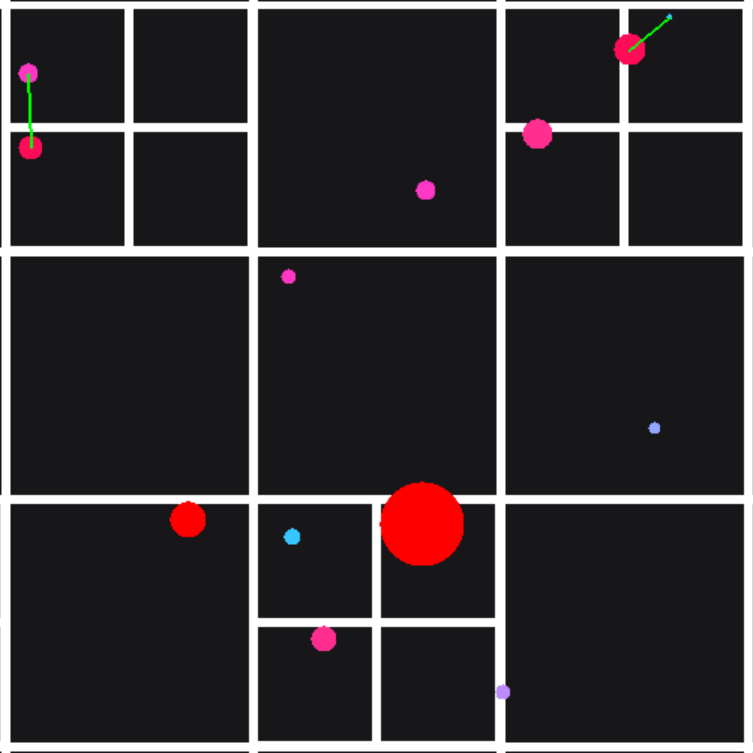

# Gravity Sim

### [Download](https://github.com/C-users-quad/gravity-sim/releases/latest)

## What is it?

**This is a 2D simulation that uses Newton's laws of gravity to simulate interactions between any number of particles.**

  
   
  <em>The simulation in debug mode with the spatial hashing boundaries visible</em>

## Controls

### Mouse Buttons

- Hold **LEFT CLICK** to drag particles.
- **RIGHT CLICK** to display info in the top-left corner about the particle / select a particle
- **SCROLL WHEEL** to change camera zoom

### Keyboard Keys

- **WASD** to move the camera around
- **ENTER** to open the particle creation menu
  - **ENTER** again to create the particle
  - **ESC** to exit the menu and not create the particle
- **ESC** to stop displaying particle info
- **BACKSPACE** to delete the selected/dragged particle
- **R** to refill simulation with particles

### Key + Mouse Combos

- **LEFT CTRL + SCROLL WHEEL** to change the camera speed
- Hold **LEFT CTRL + RIGHT CLICK** to follow the selected particle
